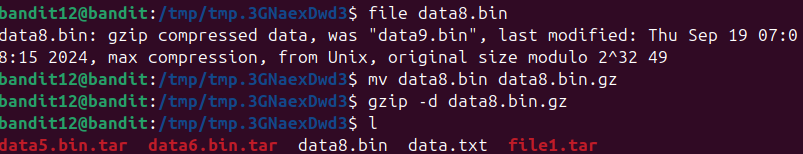

Đầu tiên ta sẽ tạo ra 1 file tạm trong /tmp\
\

Sau đó ta coppy file data từ thư mục chính vào trong thư mục hiện tại. Tiếp theo ta sẽ reverse lại file hexdump này với xxd\
\

Xác định loại file bằng lệnh file\
\

Sau đó thêm định dạng file vào sau tên file và giải nén cho file. Và ta dc 1 file mới file1\
\

Tiếp tục làm lại các bước như trên cho đến khi nhận dc flag\
\

\

\

\

\

\

\

\

Ta thấy file data8.bin là file ascii. Mở ra và nhận dc flag