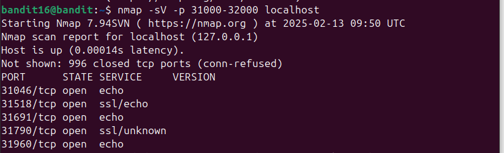
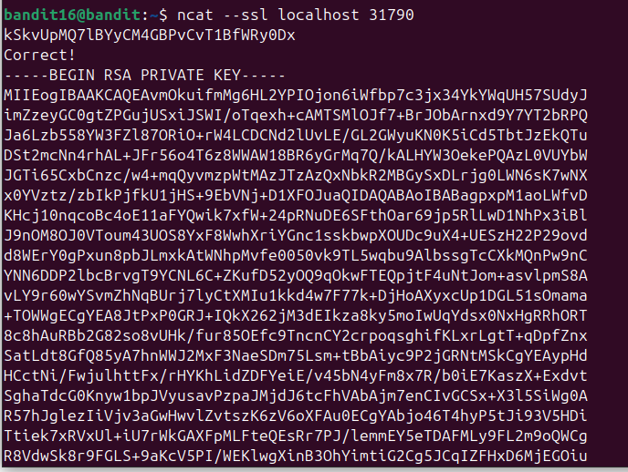
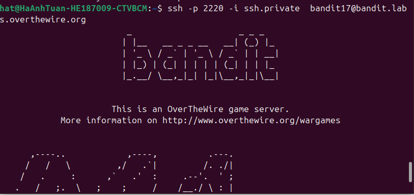

Để quét các cổng từ 31000 đến 32000 ta sử dụng nmap, kết hợp với -sV để kết quả hiện thị ra với service để xem những cổng nào có đang sử dụng ssl\
\

Kết quả trả ra 5 cổng, trong đó có 2 cổng sử dụng ssl, nhưng có 1 cổng dùng echo và cổng còn lại là unknown, vì vậy cổng cần tìm có thể là cổng này.\
\

Sau khi gửi flag từ lv trc đó ta nhận dc private key\
Vì ở đây ko thể tạo dc 1 file mới vậy nên ta sẽ tạo ra 1 file mới ở máy ảo của mình.\
sau đó ssh vào như ở những lv trc(trc khi ssh nhớ chuyển quyền về chỉ user)\
