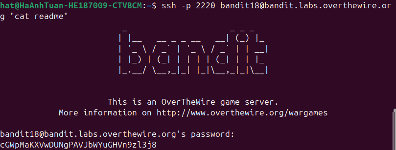

Vì file .bashrc đã dc chỉnh sửa nên khi đăng nhập sẽ bị log out ngay lập tức. Vậy nên để mở dc file readme ở home ta có thể mở file readme mà ko cần terminal hoặc ta chặn pseudo terminal dc kích hoạt. Ở đây sẽ mở file readme mà ko cần terminal\
