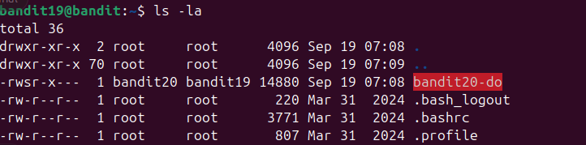
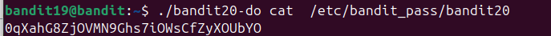

sau khi thử lệnh ls -la t có thể thấy file bandit20-do có quyền s thay vì x.\

\

Điều đó có nghĩa là khi chạy file này b sẽ có quyền như chủ sở hữu của file này và ở đây là bandit20\

Tiếp theo ta chỉ cần đọc file /etc/bandit_pass/bandit20 cùng với file bandit20-do là ta sẽ có flag \

