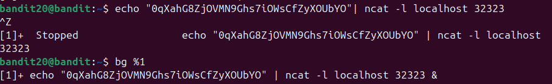
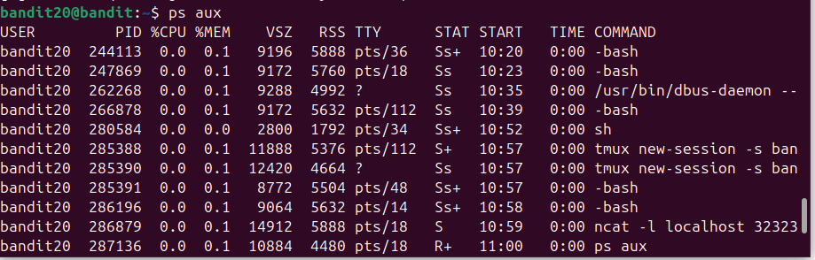
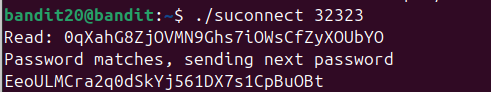

Đề bài yêu cầu gửi flag của lv trc lên 1 cổng tự chỉ định trên localhost. Và file suconnect sẽ kiểm tra xem có giống flag ở lv trước hay ko, nếu có thì sẽ trả ra flag của lv sau.\
Đầu tiên ta sẽ tạo ra 1 cổng chờ trên localhost và gửi flag của lv trước lên. Sau đó đưa tiến trình đó về bg\

\

sau đó ktra xem tiến trình đó có tồn tại ko \
\

sau đó kết nối đến cổng 32323 với file suconnect\
