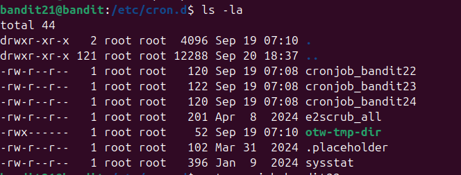
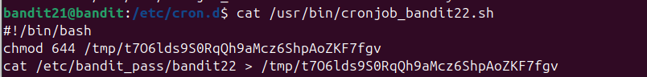

Dựa vào gợi ý ta vào /etc/cron.d và xem các file có trong này\
\
Ta thấy mục cronjob_bandit22(mục tiêu là lấy flag của lv 22), truy cập vào file đó và thấy \
\
Ở tại đây ta thấy có lệnh /usr/bin/cronjob_bandit22.sh dc thiết lập chạy mỗi khi khởi động và mỗi phút một lần. Ta tiếp tục vào thử file /usr/bin/cronjob_bandit22.sh\
Sau khi vào file /usr/bin/cronjob_bandit22.sh ta thấy có 2 lệnh. 1 là cấp quyền cho tệp /tmp/t7O6lds9S0RqQh9aMcz6ShpAoZKF7fgv và 2 là truyền flag của lv tiếp theo cho tệp này\

