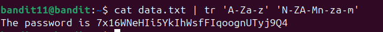

Giống như ở lv trước ta mở cron.d. Vì mục tiêu là lv23 nên sẽ truy cập vào cronjob_bandit23\
\
Ở tại đây ta thấy có lệnh /usr/bin/cronjob_bandit23.sh dc thiết lập chạy mỗi khi khởi động và mỗi phút một lần. Ta tiếp tục vào thử file /usr/bin/cronjob_bandit23.sh\
\
Ta làm lần lượt theo shell-script. Tuy nhiên vì mục tiêu là flag lv23 nên $myname sẽ là bandit23   \
