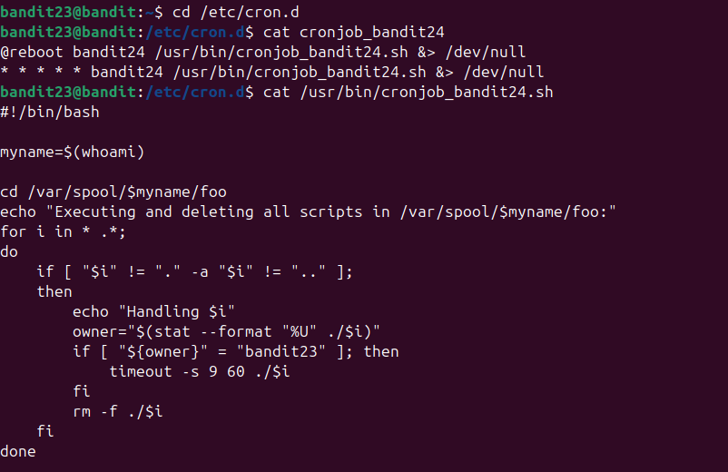
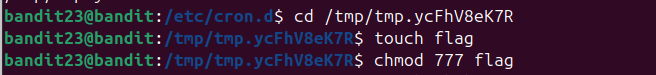
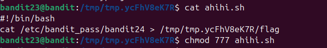
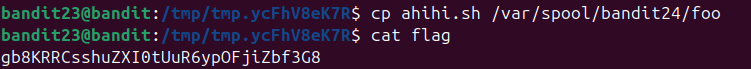

Như các lv trc chúng ta vào dần file /usr/bin/cronjob_bandit24.sh và thấy\
\
Đọc script ta có thể thấy file này sẽ lặp qua tất cả các file (bỏ qua file hiện tại và thư mục) và nếu file đó có owner là bandit23 thì sẽ dc chạy trong 60s và sau đó xóa\
Sau đó ta sẽ tạo một script cho bandit24 thực hiện và cấp quyền cho nó và 1 file để bandit24 gửi flag và cấp quyền cho nó\
\
\
Cuối cùng ta gửi file script cho bandit24 và đợi1 phút để nhận flag \
