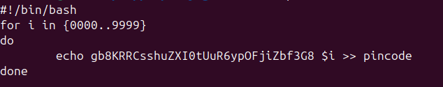

Đề bài yêu cầu kết nối đến localhost ở cổng 30002 và gửi flag của lv trước đó cùng với 1 dãy số bất kì từ 0000->9999 và đề cũng gợi ý là sử dụng bruteforce để giải.\
Vì vậy ta sẽ viết 1 scrip bao gồm flag và 1 dãy số 4 số và kết nối đến cổng 30002.\
\
Cùng với đó tạo 1 file để chứa data.\
Chạy và ktra file chứa data.
\
Cuối cùng đứa data vào cổng 30002 kết hợp sử dụng `grep -v Wrong` để loại bỏ những trường hợp sai.\
