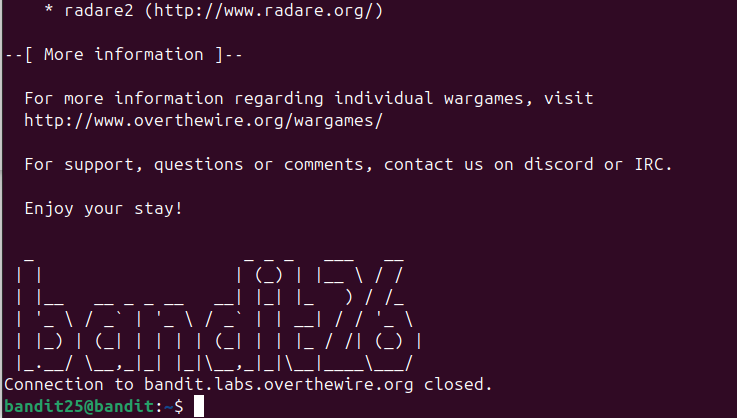
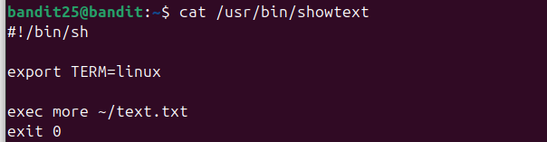
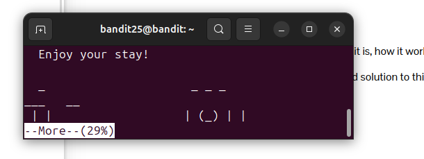
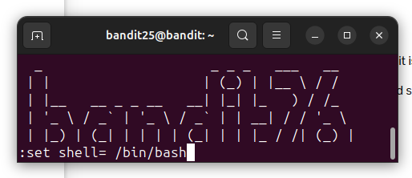
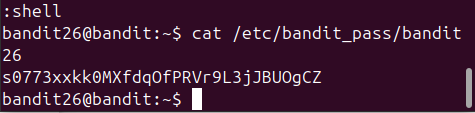

Sử dụng lệnh `ls` ta thấy được 1 file key có thể sử dụng đc `ssh -i`. Kết nối vào thử và thấy bị dis ra ngoài.\
\
Vì đề bài bảo shell mặc định của user bandit26 ko nằm ở `/bin/bash` nên sẽ dùng `/etc/passwd | grep bandit26` để tìm xem shell mặc định của user bandit26 nằm ở đâu\
\
Có thể thấy shell mặc định là `/usr/bin/showtext` thay vì `/bin/bash`. Truy cập vào xem thử\
\
Nó sẽ exit ngay sau khi show hết thông tin trong `text.txt`.Còn lênh `more` sẽ khiến file hiện thị theo từng trang. Và để lênh `more` ko kết thúc ngay khi kết nối đến bandit26, ta sẽ thu nhỏ terminal lại và khi đó `more` sẽ ko hiện hết thông tin và sẽ ko kết thúc ngay.\
\
Sau đó setup lại shell để gõ lệnh lấy flag\
\
(Trên ảnh thừa dấu cách sửa lại `:set shell=/bin/bash`)\
Sau đó mở shell lên và đọc file `/etc/pass_bandit/bandit26` để lấy flag\
