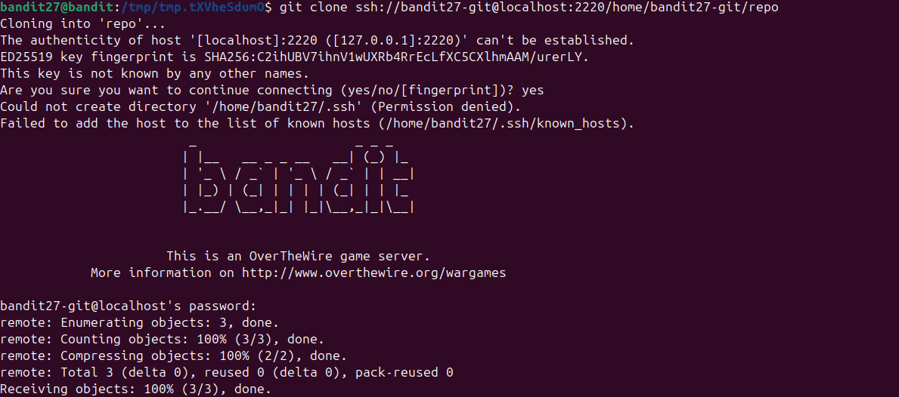

Theo đề bài ta cần phải `git clone` từ cổng 2220 về. Sau 1 hồi tra cứu trên gg thì để `git clone` theo cổng:\
`ssh://[user@]host.example[:port]/~[user]/path/to/repo`\
\
Sau đó truy cập vào file README và có dc flag\
