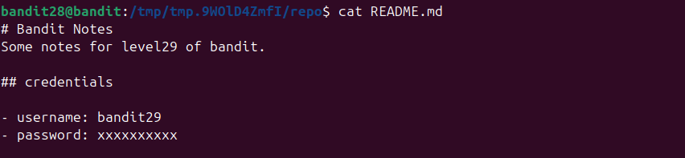
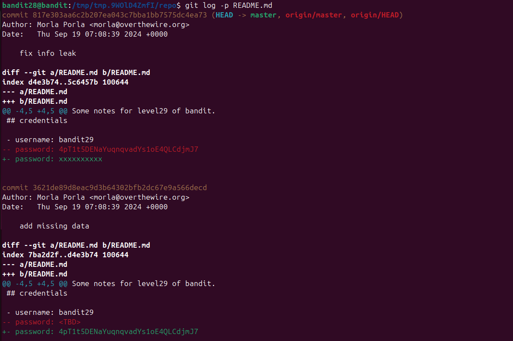

Như ở lv trước, ta `git clone` repo về và ở file readme về\
\
Thấy phần password bị che đi, có thể đã bị ai đó chỉnh sửa, vì vậy dùng lệnh `git log -p` để xem lịch sử thay đổi của file\
\
Dòng màu đỏ là dòng bị xóa đi còn dòng màu xanh là dòng dc thêm vào.