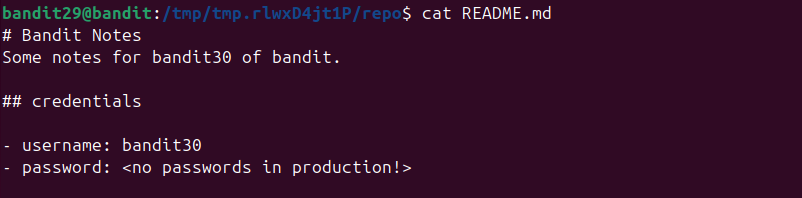
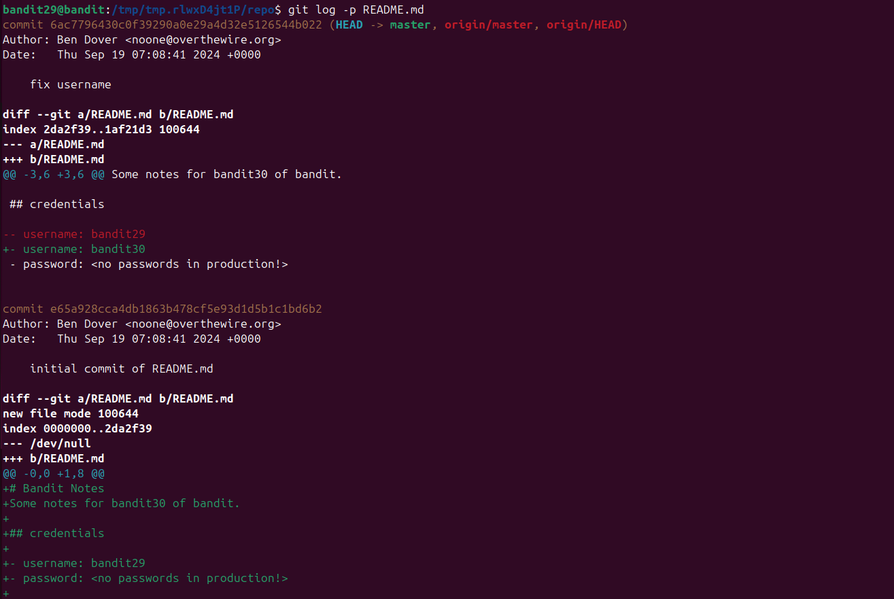
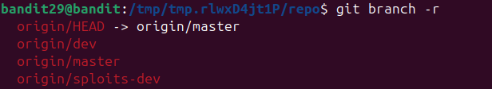
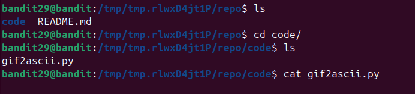

Vẫn như những lv trước ta vào phần README\
\
Tiếp tục dùng thử `git log -p` để xem có chỉnh sửa gì ko.
\
KO thấy chỉnh sửa gì phần password. Ta có thử chuyển sang nhánh khác xem có gì không. Dùng `git branch -r` để xem có những nhánh nào\
\
Dùng lệnh `git check out` để chuyển nhánh\
\
Sau khi chuyển nhánh xong check xem có những gì\
\
