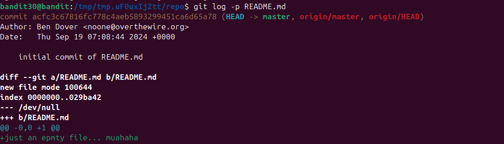
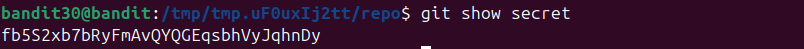

vẫn như những lv trước ta vào file README xem\
\
Thử tiếp với `git log -p`\
\
tiếp tục với `git branch -r`\
\
Cái cuối cùng có thể thử là check `git tag`\
\
thấy có 1 cái tag ta truy cập vào để xem \
