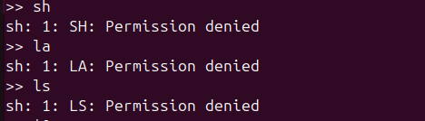
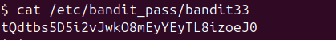

Có thể thấy đây là 1 shell biến tất cả thành chữ hoa\
\
ta có lệnh `$0` sẽ tham chiếu đến 1 bash nào đó. khi đó có thể thoát khỏi shell và có thể sử dụng lại lệnh. Khi đó chỉ cần `cat` vào `bandit_pass\bandit33`\
