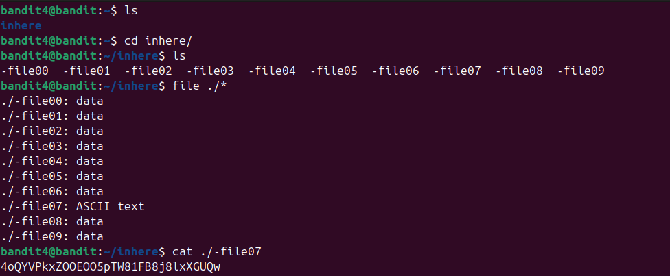

Truy cập inhere và dùng ls để hiện ra tất cả các file trong inhere
tại đây sử dụng file để xác định loại file
còn ./* là tất cả các file có trong thư mục hiện tại
cuối cùng sử dụng cat vào file07 để lấy pass
