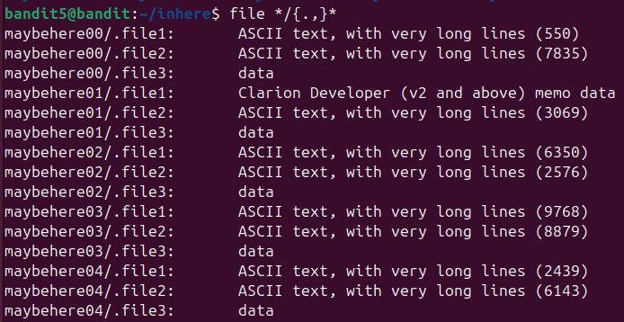
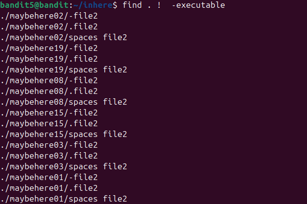
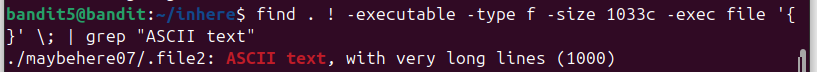
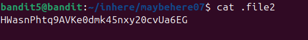

sử dụng file */{.,}* để liệt kê tất cả các file có trong thư mục con . Và chúng ta nhận thấy những file có ASCII text là những file đọc đc\
\

đến dữ kiện 1033 byte\
sử dụng find . -type f -size 1033c\ 
trong đó . dùng để tìm cả trong các file con\ 
-type f để tìm định dạng là file\
-size 1033c là có độ lớn 1033 byte\
\

đến dữ liệu cuối là not executable\
sử dụng lệnh find . ! -excutable\
! -executable là ko thực hiện lệnh execuatable\
\

và kết hợp cả 3 lệnh lại ta có : \
find . ! -execuatable -type f -size 1033c -exec file '{}' \;| grep "ASCII text"\

\

sử dụng thêm -exec file '{}' \; để chạy lệnh file với mỗi file tìm dc\

sau đó truy cập vào file đã tìm dc và lấy đc flag\
