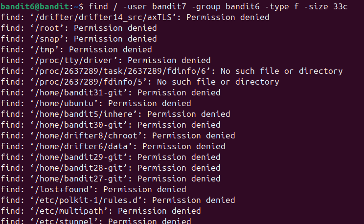
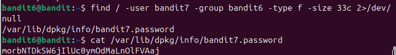

giôgsn như bài ở trên ta sử dụng find để tìm và ghép lại ta sẽ có:\
find / -user bandit7 -group bandit6 -type f -size 33c\
sử dụng / để quét toàn bộ linux\
\

tuy nhiên ta vẫn bị lỗi permission denied như trên ảnh\

vì vậy cần thêm 1 đoạn nữa để bỏ qua lỗi permission denied\

\

sau đó cat vào đường dẫn trên để lấy dc flag