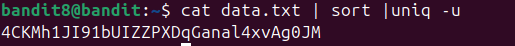

sử dụng lệnh sort để xắp sếp lại các câu theo thứ tự bảng chữ cái 
và cuối cùng sử dụng uniq -u để lọc ra câu duy nhất ko lặp
tại sao lại sử dụng sort. tại vì câu lệnh uniq sẽ so sánh 2 câu liền nhau và nếu giống nhau sẽ xóa những dòng giống nhau
